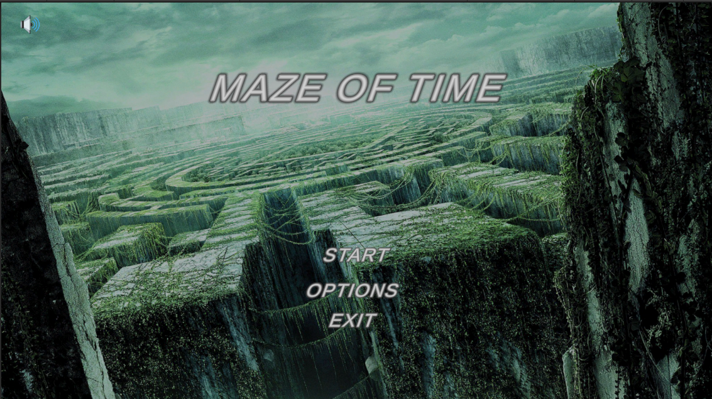
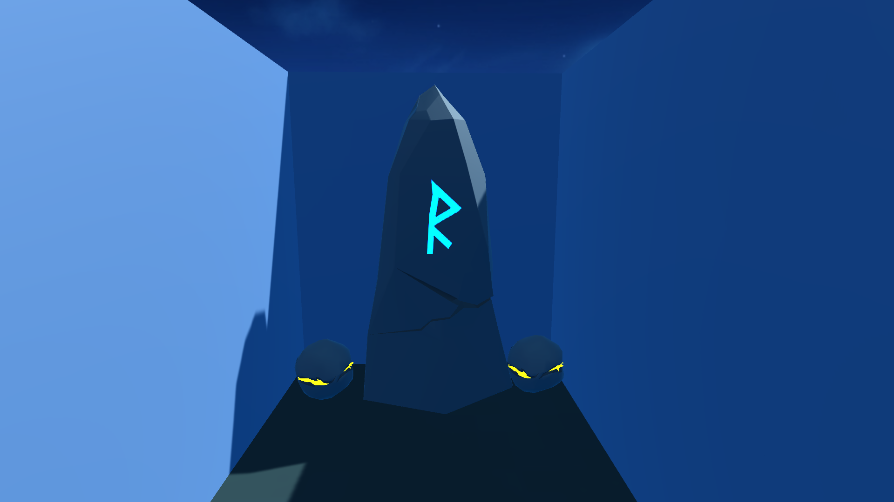
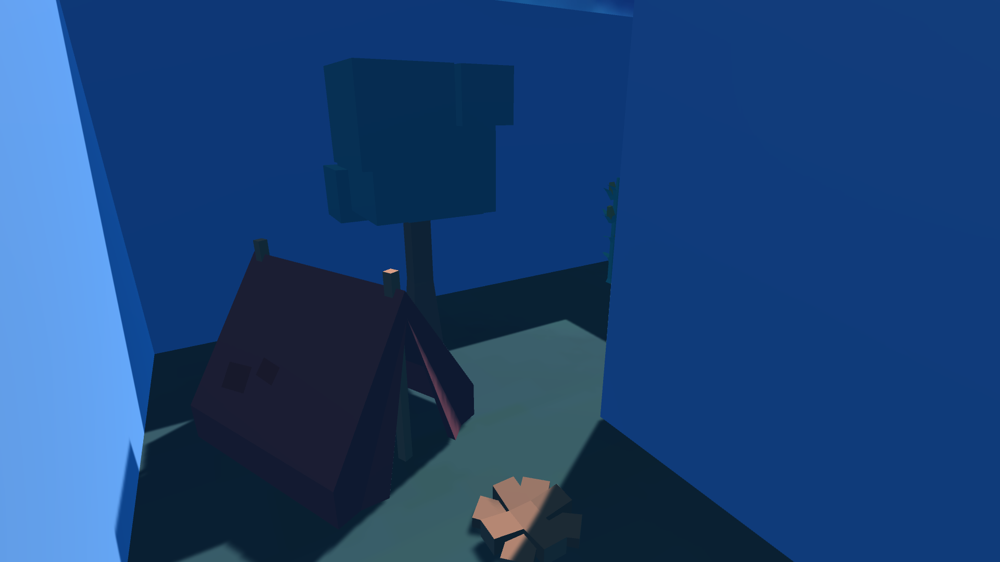
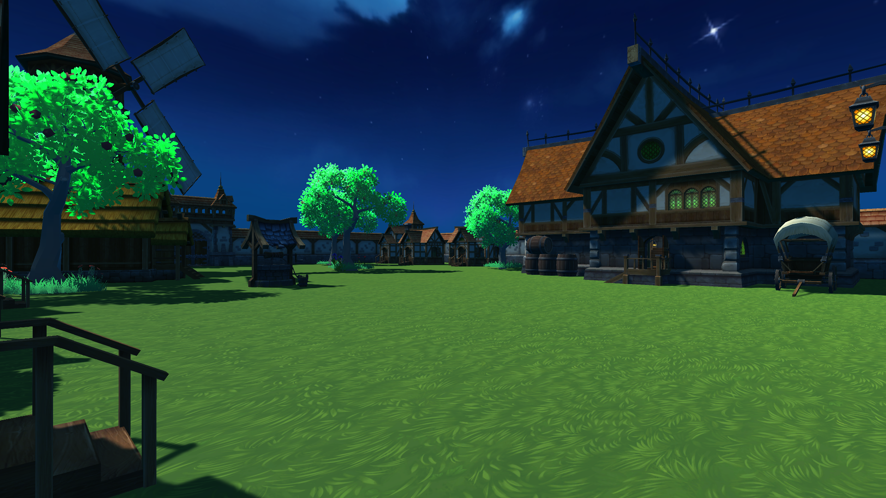
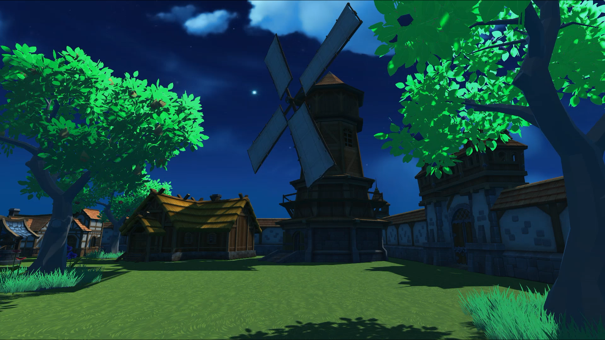

<h1 align="center"><i>The Maze of Time - Zamanın Labirenti</i></h1>

Bugün sizlere "The Maze of Time"ı sunmaktan mutluluk duyuyoruz. Bu oyun, zamanın gücünü keşfetmek ve labirentin derinliklerinde gizlenmiş bir hazineye ulaşmak için oyuncuları eşsiz bir maceraya davet ediyor.

<h3 align="center"><i>Oyunun Konsepti:</i></h3>

"The Maze of Time", dünyaya 54.6 milyon km uzaklıktaki bir gezegenden gelen Cosmo yu labirentin deriniklerine götürüyor. Cosmo, labirentte yapay zeka ile eğitilmiş düşmanlardan kaçarken labirenti çözmeye çalışıyor. Özel yeteneği sayesinde, zamanı geri alarak düşmanlarından kaçma fırsatı buluyor. Labirentin sonunda, kapıyı açıp hazineye ulaşmak için Cosmo'nun gizli anahtarı bulması gerekiyor.

<h3 align="center"><i>Tuş Takımları:</i></h3>

W, A, S, D: Uzaylı karakterin ileri, geri, sağa ve sola hareket etmesini sağlar.

Z Tuşu: Düşmanları fark ettiğinde 10 saniye geri gitmek için kullanılır.

E Tuşu: Hazine sandığını açmak için kullanılır.

<h3 align="center"><i>Sonuç:</i></h3>

"The Maze of Time", oyunculara zorlu labirentlerde zamanın gücünü kullanarak heyecan dolu bir maceraya katılma fırsatı sunuyor. Bu oyun, strateji, bulmaca çözme ve zaman yönetimi becerilerini bir araya getirerek eğlenceli bir deneyim sunuyor.

<h3 align="center"><i>Oyun Hikayesi: </i></h3>

Bu labirentin gizemli koridorlarında, zamanın dokusunu değiştirebilen bir uzaylı maceraya atılır. Yabancı bir gezegenden gelen Cosmo, kendini karmaşık bir labirentin içinde bulur. Labirent, yapay zeka ile eğitilmiş tehlikeli varlıklarla doludur ve labirentin sonundaki efsanevi hazineye ulaşmak için karakterimizin tüm yeteneklerini kullanması gerekecektir.

Labirentte ilerlerken, Cosmo düşmanlardan kaçmak ve labirentin sırlarını çözmek zorundadır. Neyse ki, özel bir yeteneği vardır: düşmanları fark ettiğinde zamanda geri giderek kaçma imkanı. Ancak, bu yetenek sınırsız değildir ve dikkatli kullanılmalıdır.

Labirentin içinde ilerlerken, Cosmo labirentin duvarlarında eski uzaylı yazıtlarını ve gizemli sembolleri keşfeder. Bu semboller, labirentin ve hazineye giden yolun sırlarını saklar.

Sonunda, uzaylı karakterimiz labirentin sonuna ulaşır ve büyük bir kapıyla karşılaşır. Ancak, kapıyı açmak için bir anahtara ihtiyacı vardır. Labirentin derinliklerinde, gizlenmiş bir odada anahtarı bulur. Bu anahtar, sadece hazine odasının kapısını açmakla kalmaz, aynı zamanda uzaylı karakterimizin kendi geçmişini de açar.

Kapıyı açtığında, karakterimiz karşısında bir hazine odasıyla karşılaşır. Büyük bir hazine sandığı, odanın ortasında durur. Uzaylı karakterimiz, sandığı açar ve içinden uzayın en değerli hazineleriyle dolu bir hazineyi görür. Bu, labirentteki zorlu maceranın sonu ve başarısının kutlanmasıdır.

The Maze of Time - Zamanın Labirenti

   

      
      
      
      
      
      
      
      
      
   

